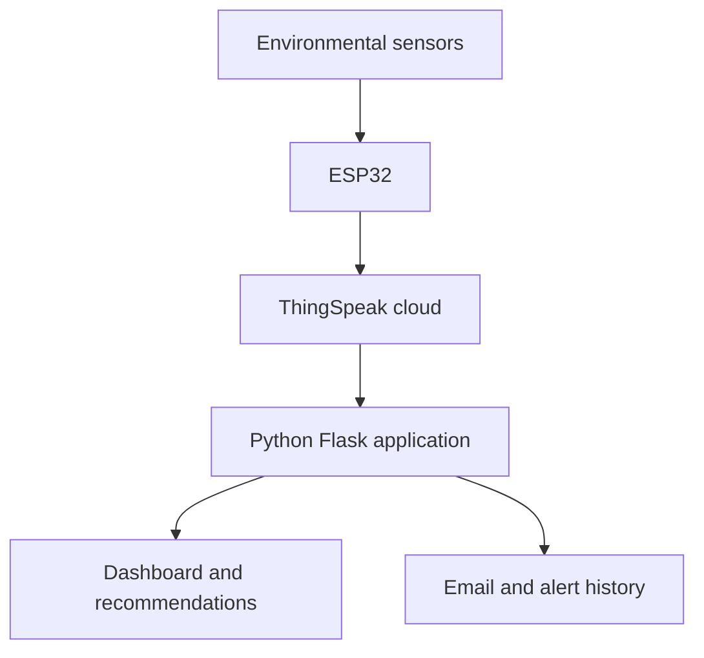

# AirSense IQ Project Explanation Guide

## 1. Project Overview

**Project name:** AirSense IQ  
**Project type:** IoT indoor air-quality monitoring and intelligent alert system  
**Status:** Live monitoring and threshold alerts operational; predictive early-warning component under development  
**Research context:** Master of Internet of Things project at the Durban University of Technology

AirSense IQ is an end-to-end IoT system that measures indoor environmental conditions, uploads the readings to the cloud, assesses air quality and presents the results through a web dashboard.

The system also generates recommendations and sends email notifications when configured air-quality thresholds are exceeded.

## 2. Thirty-Second Explanation

> I developed an IoT indoor air-quality monitoring system using an ESP32 and environmental sensors. The device measures temperature, humidity, particulate matter and carbon dioxide every minute and sends the readings to ThingSpeak. A Python Flask application retrieves the data, classifies the current air quality, displays historical trends, provides recommendations and sends threshold-based email alerts. I also implemented SQLite alert history, secure environment-variable configuration, data export and validation tools, and automated tests. The predictive early-warning component is currently being developed using the collected time-series data.

## 3. Problem Addressed

Poor indoor air quality may develop without occupants noticing it immediately.

High CO₂ can indicate inadequate ventilation, while increased particulate matter can result from indoor activities, dust or external pollution. Temperature and humidity also affect indoor comfort and environmental conditions.

The system was developed to:

- Continuously observe indoor environmental conditions
- Make sensor readings easier to understand
- Identify deteriorating conditions
- Recommend appropriate action
- Notify the user when intervention is required
- Prepare data for future predictive early warnings

## 4. System Architecture



## 5. Hardware Components

| Component | Purpose |
|---|---|
| ESP32-WROOM-32 | Main controller, sensor processing and Wi-Fi communication |
| SHT31 | Temperature and relative-humidity measurements |
| PMS5003 | PM1.0, PM2.5 and PM10 measurements |
| SCD41 | Carbon-dioxide measurements |
| ThingSpeak | Cloud storage and sensor-data API |
| Power adapters | Continuous power for the deployed monitoring node |

## 6. Data-Collection Process

1. The ESP32 reads all connected sensors.
2. Invalid or unavailable readings are identified.
3. The firmware calculates an edge-device IAQ status.
4. The firmware generates an alert/recommendation code.
5. Eight fields are uploaded to ThingSpeak.
6. The process repeats approximately every 60 seconds.
7. The Flask system retrieves the latest and historical readings.
8. Server-side assessment logic generates dashboard recommendations.
9. The alert monitor checks whether email notification is required.

## 7. ThingSpeak Field Mapping

| Field | Measurement |
|---|---|
| Field 1 | Temperature in °C |
| Field 2 | Relative humidity in % |
| Field 3 | PM1.0 in µg/m³ |
| Field 4 | PM2.5 in µg/m³ |
| Field 5 | PM10 in µg/m³ |
| Field 6 | CO₂ in ppm |
| Field 7 | Edge-device IAQ status |
| Field 8 | Edge-device alert code |

## 8. Edge-Device IAQ Status

The ESP32 uses temperature, humidity, PM2.5 and CO₂ to generate an immediate environmental-condition code.

| Code | Meaning |
|---:|---|
| 1 | Good |
| 2 | Moderate |
| 3 | Poor |
| 4 | Unhealthy |

The edge status includes comfort-related factors such as elevated temperature and humidity.

## 9. Edge-Device Alert Codes

| Code | Meaning |
|---:|---|
| 0 | No alert |
| 1 | PM2.5 warning |
| 2 | CO₂ warning |
| 3 | Humidity warning |
| 4 | Temperature warning |
| 6 | Urgent alert |

Field 8 is an edge alert code. It is not the predictive-alert result.

Future predictive alerts will be calculated by the server-side forecasting system and stored separately.

## 10. Flask Assessment Logic

The Flask application performs a separate server-side assessment focused on the project’s CO₂ and PM2.5 research thresholds.

| Status | CO₂ | PM2.5 |
|---|---:|---:|
| Good | Below 800 ppm | Below 20 µg/m³ |
| Moderate | 800–999 ppm | 20–34.9 µg/m³ |
| Poor | 1000–1999 ppm | 35–149.9 µg/m³ |
| Hazardous | 2000 ppm or higher | 150 µg/m³ or higher |

The highest detected risk determines the dashboard status.

Poor and Hazardous conditions activate conventional threshold alerts.

## 11. Dashboard Features

The dashboard provides:

- Current IAQ classification
- Live ThingSpeak readings
- Temperature and humidity cards
- PM1.0, PM2.5 and PM10 cards
- CO₂ display
- Dynamic status colours
- Historical line charts
- Threshold indicators
- Intelligent recommendations
- Device-connection status
- Alert-history records
- Automatic 60-second refresh
- Demonstration-data fallback
- Functional navigation links

## 12. Recommendation Logic

Recommendations depend on the detected condition.

Examples include:

- Continue normal room use when conditions are good
- Improve ventilation when CO₂ increases
- Investigate particle sources when PM2.5 increases
- Leave the affected area temporarily during hazardous conditions
- Continue monitoring when conditions are moderate

The recommendations are rule-based and designed to convert technical measurements into understandable actions.

## 13. Email-Alert Process

1. `alert_monitor.py` retrieves the latest ThingSpeak reading.
2. The server-side IAQ logic assesses the reading.
3. The system determines whether an alert is required.
4. A cooldown check prevents repeated emails.
5. `email_service.py` sends the notification through Gmail SMTP.
6. The alert is recorded in SQLite.
7. The dashboard displays the alert in its history section.

The monitoring interval and cooldown duration are configurable through environment variables.

## 14. Alert-History Storage

SQLite is used to store alert records locally.

Each alert record can include:

- Date and time
- IAQ condition
- Alert title
- Recommendation
- CO₂ measurement
- PM2.5 measurement
- Notification outcome

The SQLite database is excluded from GitHub because it contains runtime data rather than source code.

## 15. Data Export and Validation

`export_thingspeak_data.py`:

- Downloads readings from a selected date range
- Handles ThingSpeak’s per-request limit
- Divides large requests automatically
- Removes duplicate entry IDs
- Applies clear column names
- Saves the data as CSV
- Preserves the original cloud data

`validate_dataset.py` checks:

- Required columns
- Duplicate entries
- Invalid timestamps
- Timestamp order
- Sampling intervals
- Collection gaps
- Missing values
- Invalid numeric values
- Values outside review ranges
- IAQ-status distribution
- Alert-code distribution

Raw CSV datasets are excluded from the public repository.

## 16. Failure Handling

If ThingSpeak cannot be reached:

- The Flask application does not crash
- Demonstration readings are displayed
- The dashboard identifies the data as demonstration data
- A connection warning is presented
- The system records a warning in the application log

This allows the interface to remain available while clearly distinguishing fallback values from live data.

## 17. Security Measures

The project uses:

- A private `.env` file for configuration
- A public `.env.example` containing placeholders
- Git ignore rules for credentials and research data
- A GitHub `noreply` commit email
- Gmail app-password authentication
- No hard-coded API keys
- No raw datasets in the repository
- No student names or personal research information
- Separate runtime database storage

## 18. Automated Testing

The project currently includes eight automated tests.

The tests cover:

- Good IAQ conditions
- Moderate CO₂ conditions
- Poor CO₂ conditions
- Poor PM2.5 conditions
- Hazardous CO₂ conditions
- Hazardous PM2.5 conditions
- Successful dashboard loading
- ThingSpeak connection-failure fallback

Tests are run using:

```powershell
python -m unittest discover -s tests -t . -v
```

## 19. Main Software Files

| File | Responsibility |
|---|---|
| `app.py` | Flask application and dashboard route |
| `thingspeak_client.py` | ThingSpeak API communication |
| `iaq_logic.py` | Server-side IAQ classification and recommendations |
| `alert_monitor.py` | Repeated checking and alert decisions |
| `email_service.py` | Secure email delivery |
| `alert_store.py` | SQLite alert-history management |
| `export_thingspeak_data.py` | Research-data export |
| `validate_dataset.py` | Dataset quality validation |
| `templates/index.html` | Dashboard structure and charts |
| `static/style.css` | Dashboard design and responsive styling |
| `tests/test_iaq_logic.py` | IAQ logic tests |
| `tests/test_app.py` | Dashboard integration tests |

## 20. Technologies Demonstrated

- Python
- Flask
- HTML
- CSS
- JavaScript
- Chart.js
- SQLite
- REST API integration
- ThingSpeak
- ESP32
- Embedded sensor integration
- SMTP email
- Environment variables
- Automated testing
- Git and GitHub
- Time-series data collection
- Data validation

## 21. Challenges and Solutions

### Unreliable CO₂ readings

The earlier CO₂ sensor did not provide reliable results.

**Solution:** It was replaced with an SCD41 sensor using I²C communication.

### Multiple I²C sensors

The SHT31 and SCD41 both use I²C.

**Solution:** Their different addresses allow them to share the ESP32 I²C bus.

### Particulate-sensor communication

The PMS5003 uses UART communication rather than I²C.

**Solution:** ESP32 UART2 was configured for the particulate sensor.

### Git was unavailable on the development computer

Git commands were initially not recognised.

**Solution:** Git for Windows was installed and integrated with VS Code.

### PowerShell blocked virtual-environment activation

Windows execution policy initially prevented activation.

**Solution:** A suitable user-level execution-policy adjustment enabled the project environment.

### Protecting credentials

Email and ThingSpeak services require confidential credentials.

**Solution:** Credentials were moved into `.env`, while `.env.example` contains only safe placeholders.

### ThingSpeak connection failures

The dashboard needed to remain usable when cloud readings were unavailable.

**Solution:** A demonstration-data fallback and visible warning were implemented.

### Large research-data exports

ThingSpeak limits the number of results returned by one request.

**Solution:** The exporter divides large date ranges and combines unique readings automatically.

### Incorrect Field 8 assumption

Field 8 was initially treated as a predictive flag.

**Solution:** Firmware inspection and dataset validation confirmed that it stores categorical edge alert codes.

## 22. Current Project Status

Operational components:

- Physical sensor node
- One-minute cloud data collection
- Live dashboard
- Historical charts
- IAQ classification
- Recommendations
- Threshold email alerts
- Alert history
- Data exporter
- Dataset validator
- Automated tests

Components still under development:

- Final dataset cleaning
- Exploratory data analysis
- Forecasting model
- Predictive alert generation
- Predictive-versus-threshold evaluation
- Predictive explanations
- Final research evaluation

## 23. Predictive Development Roadmap

The planned predictive stage will:

1. Export and freeze the complete research dataset.
2. Clean invalid readings and document collection gaps.
3. Create time-series lag and rolling features.
4. Establish a persistence forecast.
5. Develop an ARIMA statistical baseline.
6. Develop Random Forest as the supporting machine-learning model.
7. Forecast CO₂ and PM2.5 deterioration 15–30 minutes ahead.
8. Generate predictive warnings.
9. Compare predictive warnings with conventional threshold alerts.
10. Measure MAE, RMSE, false alerts, missed events and warning lead time.
11. Add model explanations where appropriate.
12. Integrate predictive warnings into the Flask dashboard.

An LSTM will not be added unless its inclusion is approved and justified.

## 24. What I Contributed

I was responsible for:

- Defining the practical IAQ monitoring problem
- Selecting and integrating the hardware
- Connecting the ESP32 to ThingSpeak
- Defining the sensor-field mapping
- Deploying the physical monitoring node
- Developing the Flask dashboard
- Implementing server-side IAQ recommendations
- Configuring secure email alerts
- Implementing alert history
- Creating the research-data exporter
- Developing dataset-validation checks
- Writing and running automated tests
- Managing the project with Git and GitHub
- Documenting the system
- Planning the predictive evaluation

This section should always be explained honestly and in your own words during an interview.

## 25. Two-Minute Interview Explanation

> AirSense IQ is my Master of IoT project. I built a physical indoor air-quality monitoring node around an ESP32. It uses an SHT31 for temperature and humidity, a PMS5003 for particulate matter and an SCD41 for carbon dioxide. The ESP32 collects measurements every minute and uploads eight fields to ThingSpeak.
>
> I developed a Python Flask application that retrieves live and historical readings through the ThingSpeak API. The dashboard classifies the current condition, changes its visual status, displays charts and generates practical recommendations. A separate monitoring service checks readings and sends email alerts when CO₂ or PM2.5 exceeds the configured thresholds. Alerts are stored in SQLite and displayed on the dashboard.
>
> I protected credentials through environment variables, implemented a fallback when ThingSpeak is unavailable, created tools to export and validate the research dataset, and added automated tests. The live monitoring and conventional alerts are operational. The next research stage uses the collected time-series data to predict deterioration 15–30 minutes before a normal threshold alert would occur.

## 26. Common Interview Questions

### Why did you use an ESP32?

It provides Wi-Fi connectivity, multiple communication interfaces and sufficient processing capability for a low-cost IoT sensor node.

### Why did you use ThingSpeak?

ThingSpeak provides accessible cloud storage, visualisation and an API suitable for collecting time-series IoT readings.

### Why did you use Flask?

Flask is lightweight, works well with Python data-processing tools and allowed me to build a customised dashboard and alert service.

### How are credentials protected?

All confidential values are stored in a local `.env` file excluded from Git. The repository contains only safe placeholders.

### What happens if ThingSpeak is unavailable?

The Flask application handles the connection error, displays a warning and uses clearly labelled demonstration data rather than crashing.

### How do you prevent repeated emails?

The alert monitor uses a configurable cooldown period and checks the recent alert state before sending another notification.

### How do you know the data is reliable?

The validator checks timestamps, duplicates, missing values, physical ranges, sampling gaps and the distribution of device-generated codes.

### Why are Field 7 and the Flask status not identical?

Field 7 is an edge-device environmental-condition code that also considers temperature and humidity. Flask applies separate research alert thresholds focused on CO₂ and PM2.5.

### Is the predictive system finished?

Not yet. The live monitoring and threshold alert system are operational. The final dataset is still being collected, after which the forecasting model and predictive-alert evaluation will be completed.

### What was the biggest lesson?

The project showed me that an IoT system is more than connecting sensors. It also requires reliable communication, secure configuration, data validation, failure handling, testing and understandable user recommendations.

## 27. CV Description

**AirSense IQ – IoT Indoor Air Quality Monitoring System**  
*Python, Flask, ESP32, ThingSpeak, SQLite, JavaScript*

- Developed an end-to-end IoT system that collects temperature, humidity, particulate matter and CO₂ measurements at one-minute intervals.
- Built a Flask dashboard with live readings, historical charts, IAQ classification and actionable recommendations.
- Implemented secure email alerts, SQLite alert history, ThingSpeak data export, dataset validation and automated testing.
- Currently developing a 15–30-minute predictive early-warning component as part of Master of IoT research.

## 28. Demonstration Sequence

When demonstrating the system:

1. Explain the problem.
2. Show the physical ESP32 sensor node.
3. Show live ThingSpeak updates.
4. Open the Flask dashboard.
5. Explain each sensor card.
6. Show the IAQ status and recommendation.
7. Show the historical charts.
8. Explain threshold-alert logic.
9. Show the alert-history section.
10. Run the automated tests.
11. Explain the exporter and validator.
12. Clearly distinguish completed features from predictive work still under development.