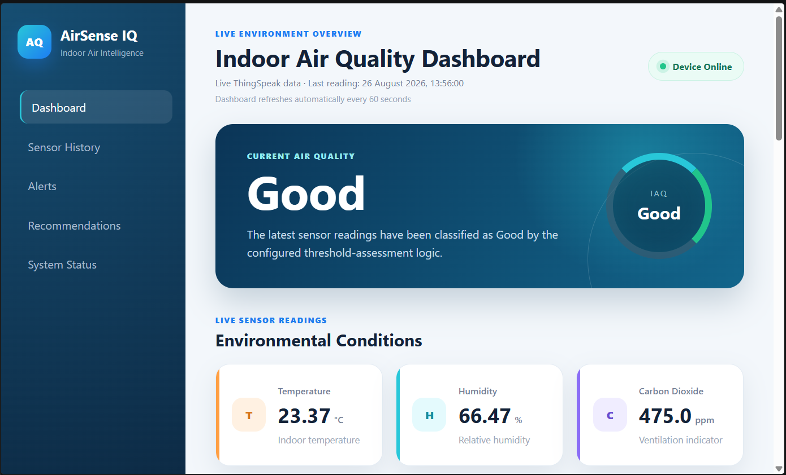
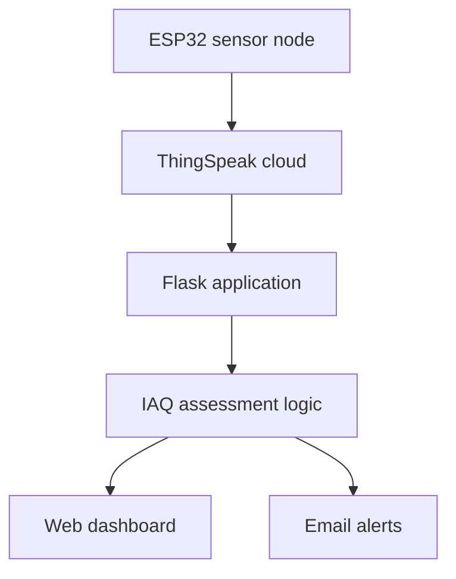

# AirSense IQ: IoT Indoor Air Quality Monitoring System

AirSense IQ is an IoT-based indoor air quality monitoring system developed as part of a Master of IoT research project.

The system collects environmental measurements from an ESP32 sensor node, stores them on ThingSpeak and presents them through a Flask dashboard. It classifies current air quality, generates recommendations and sends email alerts when conditions deteriorate.



## Current Features

- Live ThingSpeak sensor readings
- Automatic dashboard refresh
- Temperature and humidity monitoring
- PM1.0, PM2.5 and PM10 monitoring
- CO₂ monitoring
- Indoor air quality classification
- Colour-coded dashboard status
- Actionable ventilation recommendations
- Historical sensor charts
- Threshold-based email notifications
- SQLite alert-history storage
- Demonstration-data fallback
- Automated unit and dashboard tests
- Responsive dashboard navigation

## System Architecture



## Sensor Measurements

| ThingSpeak field | Measurement |
|---|---|
| Field 1 | Temperature |
| Field 2 | Humidity |
| Field 3 | PM1.0 |
| Field 4 | PM2.5 |
| Field 5 | PM10 |
| Field 6 | CO₂ |
| Field 7 | Edge-device IAQ status |
| Field 8 | Alert and recommendation code |

### Edge-Device IAQ Codes

| Code | Meaning |
|---:|---|
| 1 | Good |
| 2 | Moderate |
| 3 | Poor |
| 4 | Unhealthy |

### Edge-Device Alert Codes

| Code | Meaning |
|---:|---|
| 0 | No alert |
| 1 | PM2.5 warning |
| 2 | CO₂ warning |
| 3 | Humidity warning |
| 4 | Temperature warning |
| 6 | Urgent alert |

Fields 7 and 8 record the classifications generated by the
ESP32 firmware. The original sensor measurements in Fields 1–6
remain available for later cleaning, analysis and predictive
modelling.

## Flask Dashboard IAQ Classification

The current rule-based assessment uses CO₂ and PM2.5 measurements.

| Classification | CO₂ | PM2.5 |
|---|---:|---:|
| Good | Below 800 ppm | Below 20 µg/m³ |
| Moderate | 800–999 ppm | 20–34.9 µg/m³ |
| Poor | 1000–1999 ppm | 35–149.9 µg/m³ |
| Hazardous | 2000 ppm or higher | 150 µg/m³ or higher |

The highest detected risk level determines the overall air-quality classification.

## Technology Stack

- Python
- Flask
- HTML
- CSS
- JavaScript
- Chart.js
- SQLite
- ThingSpeak
- ESP32
- Git and GitHub

## Project Structure

```text
iot-iaq-monitoring-system/
├── static/
│   └── style.css
├── templates/
│   └── index.html
├── tests/
│   ├── __init__.py
│   ├── test_app.py
│   └── test_iaq_logic.py
├── screenshots/
│   └── dashboard.png
├── alert_monitor.py
├── alert_store.py
├── app.py
├── iaq_logic.py
├── thingspeak_client.py
├── requirements.txt
├── .env.example
└── README.md
├── export_thingspeak_data.py
├── validate_dataset.py
```

## Installation

### 1. Clone the repository

```powershell
git clone https://github.com/trevolan/iot-iaq-monitoring-system.git
cd iot-iaq-monitoring-system
```

### 2. Create a virtual environment

```powershell
python -m venv .venv
```

### 3. Activate the virtual environment

```powershell
.\.venv\Scripts\Activate.ps1
```

### 4. Install the dependencies

```powershell
python -m pip install -r requirements.txt
```

### 5. Create the environment file

```powershell
Copy-Item .env.example .env
```

Add the required ThingSpeak and email configuration values to `.env`.

Never commit the real `.env` file or expose passwords and API keys.

## Running the Dashboard

```powershell
python -m flask --app app run --debug
```

Open the following address:

```text
http://127.0.0.1:5000/
```

## Running the Alert Monitor

Open another terminal, activate the virtual environment and run:

```powershell
python alert_monitor.py
```

The monitor checks new ThingSpeak readings and sends an email when the configured alert conditions are met.

## Running the Tests

```powershell
python -m unittest discover -s tests -t . -v
```

The current automated test suite contains eight tests covering:

- Good air-quality conditions
- Moderate CO₂ conditions
- Poor CO₂ conditions
- Poor PM2.5 conditions
- Hazardous CO₂ conditions
- Hazardous PM2.5 conditions
- Successful dashboard loading
- ThingSpeak connection-failure fallback

## Research Development Roadmap

The next research stage will introduce predictive early-warning capabilities:

- Prepare and clean the collected ThingSpeak dataset
- Develop an ARIMA forecasting baseline
- Investigate a simple LSTM forecasting model
- Predict IAQ deterioration 15–30 minutes in advance
- Compare predictive alerts with conventional threshold alerts
- Evaluate MAE, RMSE and warning lead time
- Add explanations for predictive recommendations

## Project Status

The live monitoring, threshold assessment, recommendations, dashboard, email alerts and automated tests are operational.

The predictive forecasting and predictive-alert components remain under development while official sensor data is being collected.

## Author

**Trevolan Johnny **  
Master of Internet of Things  
Durban University of Technology